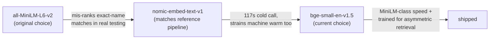
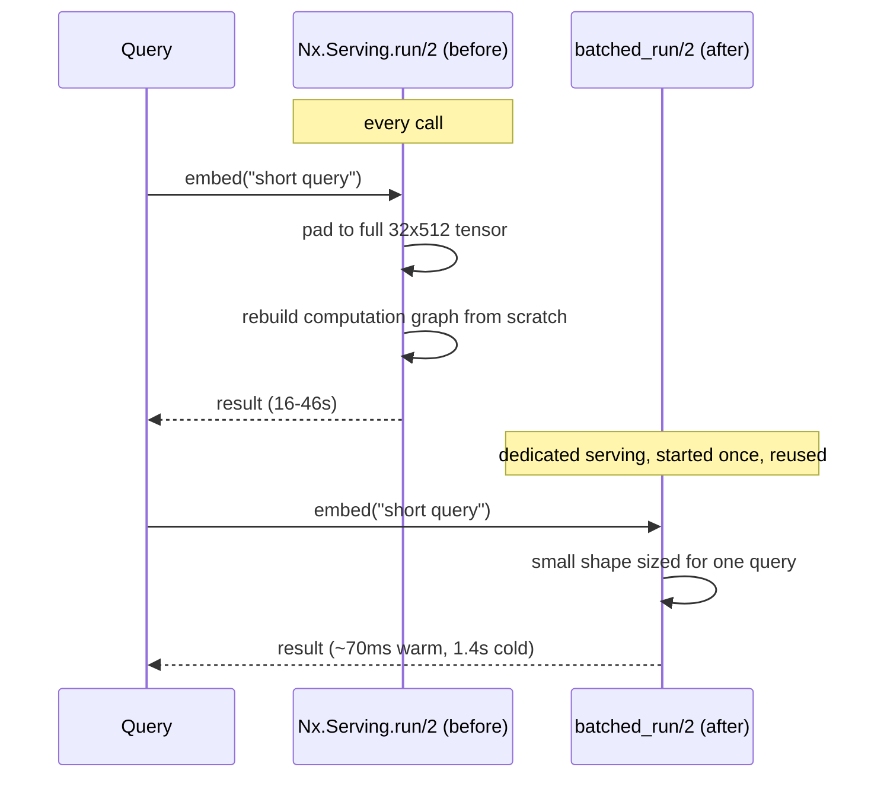
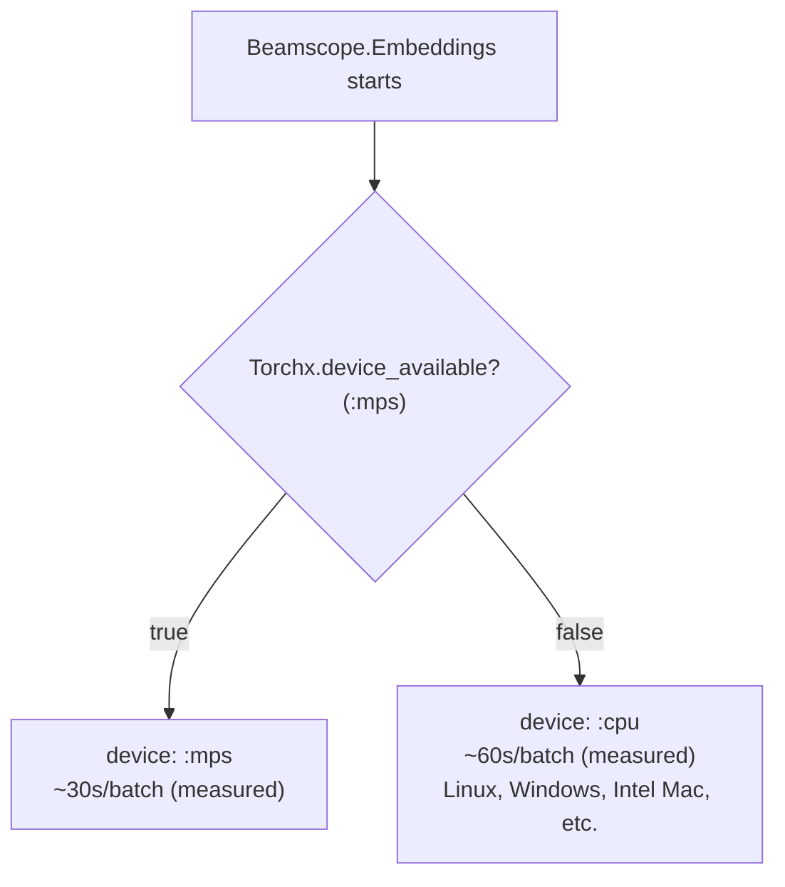
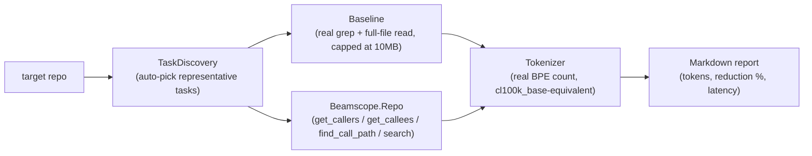
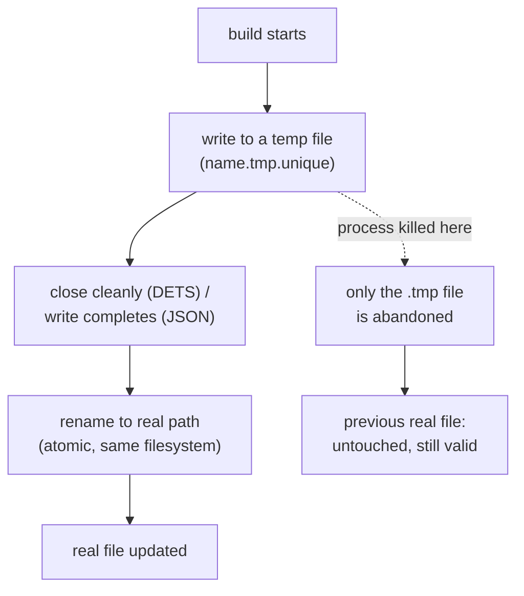
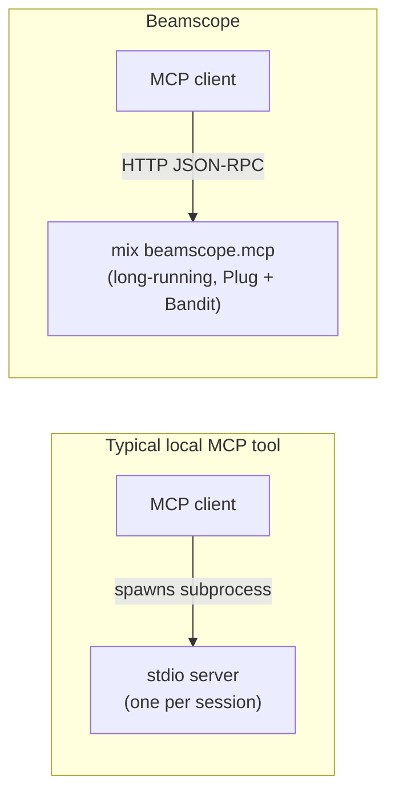

# Engineering notes

This document records the architecture decisions, benchmark methodology,
and measured results behind beamscope — for anyone evaluating whether to
adopt it, deciding whether to trust its claims, or contributing to it. For
day-to-day usage, see [README.md](README.md) instead.

## Why `:epp`/`Code.string_to_quoted` instead of tree-sitter

Erlang codebases lean heavily on macros (`-define`) for things like
backend dispatch and logging. A tool that reads source text with a
generic grammar (tree-sitter, a text index, an LSP symbol index) sees the
macro invocation, not what it expands to — it doesn't error or warn, it
just silently doesn't know the real call target.

`:epp` (the Erlang preprocessor) and `Code.string_to_quoted/2` are the
same frontends the Erlang and Elixir compilers themselves use. Building
chunking and call-graph extraction on them means a call hidden behind a
macro resolves to its real target, because the extractor sees the code
after macro expansion, exactly as the compiler does — not an
approximation of it. This is the one architectural bet the whole project
is built around; everything else follows from it.

## Phase 0: chunking + call-graph parity validation

Before building anything beyond a spike, chunking and call-graph
extraction were validated against two real production Erlang codebases
(MongooseIM and amoc-arsenal-xmpp — see `priv/fixtures/`, gitignored
research checkouts, not package fixtures) for parity against a reference
Python/tree-sitter pipeline. Call targets that can't be statically
resolved (dynamic dispatch, e.g. `Mod:Fun()` where `Mod` is a variable)
are marked with callee module `"?"` rather than silently dropped or
misattributed — an honest "I don't know," not a wrong answer.

## Semantic search: embedding model selection

Model choice went through two real, measured revisions, not a single
guess:

1. `sentence-transformers/all-MiniLM-L6-v2` (the original choice)
   mis-ranked an exact-name match in real testing — it isn't trained for
   asymmetric query/passage retrieval, so a query and the passage
   answering it don't reliably land close together in its embedding
   space.
2. `nomic-ai/nomic-embed-text-v1` (the same model family the original
   Python/Ollama reference pipeline used) fixed that class of problem in
   principle, but measured at **117 seconds for a single cold call** on
   Torchx's eager (no-JIT) CPU execution, and kept straining the machine
   on warm calls too — disqualifying for an interactive tool.
3. `BAAI/bge-small-en-v1.5` (current choice) is back in MiniLM's
   size/speed class (fast, no custom-architecture risk) but — unlike
   MiniLM — is trained specifically for asymmetric query/passage
   retrieval.

Torchx (not EXLA) is the `Nx` backend, specifically because EXLA has no
native Windows binaries (Windows needs WSL to use it at all); Torchx
auto-downloads a precompiled CPU libtorch build and works natively on
Windows.

## Performance: diagnosing and fixing `search_code` latency

`search_code` originally measured 16–46 *seconds* per query (even warm)
and 6.5–12 *minutes* to cold-index even a small directory. The vector
search step itself was always sub-second — the actual cause was two
compounding bugs in `Beamscope.Embeddings`:

- Every short query was padded up to a full `32×512` tensor (~1000x
  needless compute).
- Each call rebuilt the model's whole computation graph from scratch
  instead of reusing an already-running serving.

Fixed by compiling a dedicated, small-shape serving for queries and
switching to `Nx.Serving`'s stateful/process workflow (`start_link` +
`batched_run`, rather than the inline `run/2` API). Result: **1.4s for a
fully cold call, ~70ms warm** — without adding an external vector
database, since the search step was never the slow part.

## Performance: preferring MPS (Apple GPU) over CPU when available

Even after the query-serving latency fix above, the *document* serving
(32×512, used while indexing/embedding chunks) was still hard-coded to
`device: :cpu` — a deliberate choice at the time, following the same
portability reasoning behind choosing Torchx over EXLA in the first place
(one code path that works identically on every install target, not just
one machine). Indexing a real, moderately large repo (Phoenix framework's
own source) surfaced how expensive that per-batch cost actually is: the
first `search_code` call against a real-sized repo can look "stuck" for
several minutes with zero progress output, because each 32-chunk batch
genuinely takes about a minute on CPU.

Measured directly (32×512 batch — the real per-batch cost paid during
indexing, not a one-time compile; cold/warm/warm-2 are three consecutive
calls against an already-started serving):

| | Cold | Warm | Warm 2 |
|---|---:|---:|---:|
| CPU | 56.6s | 61.8s | 60.5s |
| MPS (Apple GPU) | 26.4s | 28.2s | 32.4s |

A real ~2x speedup, not an estimate. Two things were verified before
switching, rather than assumed:

- **Correctness**: the MPS output is unit-norm (`1.0000000899...`, as
  expected from the model's `l2_norm` post-processing), contains no NaN,
  and is the correct 384-dim vector for this model.
- **Whether MPS's known gaps actually apply here**: Torchx documents a
  specific list of operations unsupported on MPS (`LU`, `Eigh`, `Solve`,
  `Determinant`, `Cholesky` — linear-algebra decompositions), none of
  which a BERT-style embedding forward pass ever calls.

Fixed by preferring `:mps` when `Torchx.device_available?/1` reports it,
falling back to `:cpu` everywhere else — Linux, Windows, Intel Macs, or
any Mac without it. Purely additive: any platform without an available
MPS device gets exactly the prior CPU-only behavior, unchanged.

## Token efficiency: methodology and results

The point of building on `:epp`/`Code.string_to_quoted` was never
"better architecture" for its own sake — it's reducing how many tokens an
AI coding agent burns navigating a large Erlang/Elixir codebase.

**Methodology**: real BPE token counts (via the `tokenizers` Hex package
and a vendored `cl100k_base`-equivalent tokenizer, cross-checked against
real `tiktoken`), not a `char/4` estimate. Baseline is a real
grep-equivalent scan + full read of every matching file, capped at 10MB
to keep a runaway match from exhausting memory (see `Beamscope.Benchmark.Baseline`).
`mix beamscope.benchmark --repo /path/to/repo` runs this automatically —
auto-discovers representative tasks per repo (highest-in-degree function
for `get_callers`, etc.), measures both sides, and writes a timestamped
Markdown report.

**Results** (18-task benchmark across three real codebases — MongooseIM,
amoc-arsenal-xmpp, and the Elixir language's own source; 16 tasks scored):

| | Baseline (grep/read) | Beamscope (MCP tool) | Reduction |
|---|---:|---:|---:|
| **Total tokens** | 1,355,159 | 5,807 | **99.6%** |
| `get_callers`/`get_callees`/`find_call_path` (11 tasks) | — | — | 100% passed quality grading, 98–99.95% reduction |
| `search_code` (5 tasks) | — | — | mixed quality (see below), 95.7–99.6% reduction |

**Quality is genuinely bimodal for `search_code`**, confirmed
independently across the three codebases: conceptual queries ("code that
does X", no name given) pass cleanly; exact-name queries ("where is `foo`
defined") lose to grep every time, because semantic search is
probabilistic ranking and grep is a guaranteed exact match — the wrong
tool for a task that already has an exact string to match against. This
is why `search_code` returns `exact_matches` (a literal grep for
identifier-like terms in the query) alongside — not blended into —
`semantic_matches`.

**Discover + edit, the full task, not just discovery**: `get_callers`/
`get_callees` return each caller/callee enriched with its definition's
`file_path`/`start_line`/`end_line`, so editing a found call site only
needs the enclosing function, not the whole file. Measured on one real
task (11 real callers, 8 files): discovery alone is a 99.0% reduction
(665 vs. 10,003 tokens), and the full discover+edit task — enriched
response plus reading just each call site's enclosing snippet — comes to
1,281 tokens vs. the same 10,003-token baseline, an **87.2% reduction**.

## Crash-resilient persistence

Both the call graph and the search index are cached in-memory per repo
path and persisted to disk (`<repo_path>/.beamscope/callgraph.json` and
`search.dets`) so a server restart doesn't require rebuilding from
scratch.

Writes are atomic: a build writes to a `.tmp.<unique>` file first, and
only renames it into place after it's fully written (JSON) or cleanly
closed (DETS). This was driven by a real incident: a killed indexing
process left a DETS file "not properly closed," and DETS's automatic
repair-on-reopen reset it to empty rather than salvaging prior progress,
forcing a full re-index. Before building the fix, DETS's on-disk header
format was read directly (OTP's `dets_v9.erl`/`dets.hrl`) to confirm it
carries no filename or path — only a magic cookie, version, header MD5,
and a `closed_properly` flag — so a temp-file-then-rename is safe
regardless of what path the file was originally opened at. A crash
mid-build now only ever abandons a temp file; the last-known-good real
file is untouched.

## MCP transport: HTTP, not stdio

Most local MCP clients (Claude Desktop, Claude Code) default to spawning
a subprocess and talking over stdio. Beamscope's MCP server instead runs
over HTTP — matching how [Tidewave](https://hexdocs.pm/tidewave/mcp.html),
a widely-used production Elixir MCP server, does it: mounted HTTP, not a
spawned stdio subprocess. This fits a BEAM server that's typically
already long-running (e.g. attached to a Phoenix app) rather than spawned
per-session.

The MCP layer (`Beamscope.MCP.Protocol`/`Beamscope.MCP.Router`) is built
directly on `Plug` + `Bandit` + `Jason`, with no MCP protocol library. A
handful of stateless tools don't need a full client/server SDK (session
tracking, SSE, batching, capability negotiation beyond `tools`) — a
~90-line JSON-RPC dispatcher covers exactly what's needed without taking
on a large, mostly-unused dependency tree.
