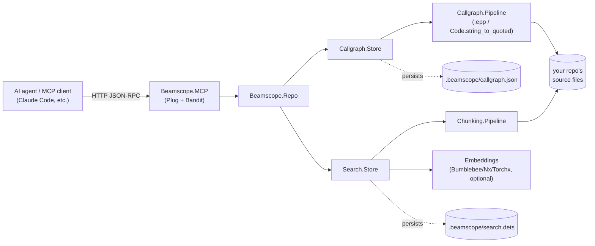
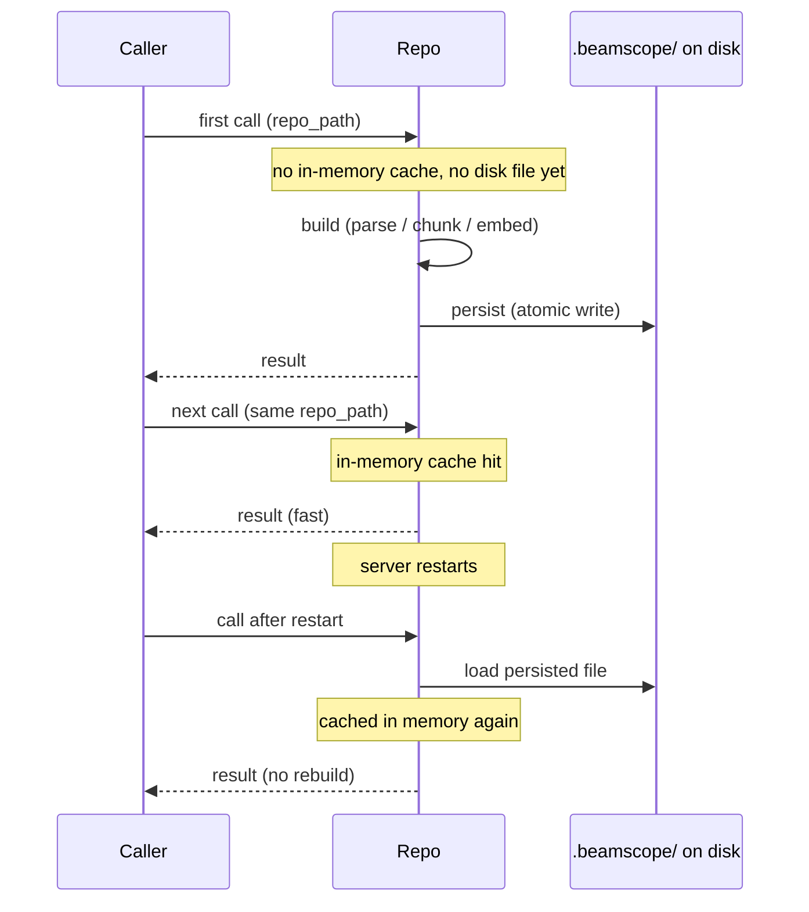

# Beamscope

Compiler-accurate code intelligence for BEAM codebases (Erlang and Elixir).

## Why this exists

AI coding agents burn a large share of their context window just
*finding* the code relevant to a question, before they can reason about
it — and that cost is worse on large, mature Erlang/Elixir codebases than
on most languages, because BEAM code leans on real compile-time macros
for common patterns (backend dispatch, logging wrappers, `-define`-based
DSLs). Beamscope's goal is narrow and specific: **cut the token cost of
navigating a BEAM codebase, with measured evidence, not promises.**
Structural correctness (seeing through macros, an accurate call graph) is
the means to that end, not the end in itself.

The approach: chunking and call-graph extraction are built on `:epp` and
`Code.string_to_quoted/2` — the same frontends the compiler itself uses —
instead of a generic syntax grammar. On Erlang specifically, this means
macros are seen exactly as the compiler sees them: a call hidden behind a
`-define`d macro resolves to its real target, not an opaque token.

In benchmarks across three real codebases, using beamscope instead of raw
grep/read cuts token usage by 90–100% on call-graph queries. See
[ENGINEERING.md](ENGINEERING.md) for the architecture decisions,
benchmark methodology, and full results.

This is deliberately **not** a general-purpose, many-language code
intelligence platform — it exists to be deep and correct on BEAM
specifically, not broad across every language.

## How this differs from other approaches

Existing BEAM code-intelligence options generally fall into two
categories, and each has a real, structural reason it doesn't cover this
specific case:

- **Broad, many-language code-search tools.** Often more full-featured
  than beamscope in most respects — more languages, more query types.
  But BEAM languages are a small slice of a large addressable market for
  a generalist tool, so the depth of language-specific handling varies a
  lot across what they support, and macro-aware call resolution for
  Erlang specifically isn't something a generalist architecture is
  well-positioned to prioritize.
- **Language-server/syntax-grammar-based tooling.** Good, often
  excellent, for straightforward symbol lookup. Some of these do attempt
  macro-aware analysis on top of a generic syntax tree — but that means
  *reimplementing* macro semantics separately from the real compiler,
  which risks diverging from it in edge cases. Beamscope avoids that
  category of risk by construction: it calls `:epp`/
  `Code.string_to_quoted/2` directly, so macro expansion is whatever the
  real compiler produces, not a second, independent approximation of it.

Neither of these makes existing tools bad — most of what they do, they do
well, for the languages and use cases they're built around. This is a
narrower claim than "better than everything": beamscope exists
specifically for codebases where seeing through macros reliably is worth
a dedicated tool. If your BEAM codebase barely uses macros, the gap this
closes matters a lot less to you.

## How it works



`Repo` is the single entry point both the MCP server and direct callers go
through. The call graph and search index are each built once per
`repo_path`, cached in memory, and persisted to disk so a restart doesn't
mean re-parsing or re-embedding the whole repo (see
[Limitations](#limitations) for what's not yet incremental about that).
`search_code`'s embedding step is the only part of this that touches the
optional `bumblebee`/`nx`/`torchx` deps — everything else works with zero
ML dependencies. See [ENGINEERING.md](ENGINEERING.md) for why each piece
is built the way it is.

## Status

Chunking and call-graph parity are validated against real production
Erlang codebases. The MCP server (call graph + semantic search) works
end-to-end and is verified as a real `mix` dependency in an external
Elixir app. **No incremental indexing yet** — every index build
reprocesses the whole repo from scratch (see
[Limitations](#limitations)). Published on
[Hex](https://hex.pm/packages/beamscope) — see [Setup](#setup).

## Setup

Add to the consuming project's `mix.exs`:

```elixir
def deps do
  [
    {:beamscope, "~> 0.1.2"}
  ]
end
```

```
mix deps.get
```

If the consuming project uses [Igniter](https://hexdocs.pm/igniter),
`mix igniter.install beamscope` does the same `mix.exs` edit and prints a
notice listing what's wired up right now.

Prefer to track the git repo directly (a specific commit, or `main`)
instead of a Hex release:

```elixir
{:beamscope, git: "https://github.com/mangalakader/beamscope.git"}
# or, against a local checkout:
# {:beamscope, path: "../beamlens_spike"}
```

```
mix igniter.install beamscope@git:https://github.com/mangalakader/beamscope.git
```

**Ignore the build artifacts.** Once you index a repo (see below), beamscope
writes `<repo_path>/.beamscope/` there — a rebuildable cache, like `_build/`,
not something to commit or ship. Add to the *consuming* project's
`.gitignore` (and `.dockerignore`, if you build container images):

```
.beamscope/
```

**Optional — only needed for `search_code` (semantic search)** — add the ML
deps too:

```elixir
{:bumblebee, "~> 0.7"},
{:nx, "~> 0.12"},
{:torchx, "~> 0.12"}
```

Building Torchx's NIF needs a C/C++ toolchain and `cmake` on the machine
running `mix deps.get`/`mix compile` the first time — install that first if
you don't already have it (e.g. `brew install cmake` on macOS). Everything
after that is automatic — no Ollama, Qdrant, or Docker to run.

## First run

Start the MCP server:

```
mix beamscope.mcp                # http://localhost:9877/mcp
mix beamscope.mcp --port 8080
```

Connect an MCP client to that URL as a remote HTTP server (not a spawned
stdio subprocess). There's no separate "index this repo" step: every tool
call takes an explicit `repo_path`, and the first call for a given path
builds (and caches, and persists to `<repo_path>/.beamscope/`) whatever it
needs on demand.

- `get_callers`/`get_callees`/`find_call_path` build the call graph on
  first use — seconds for a small repo, longer for a real production-sized
  one (this is the one-time cost of walking and parsing every file).
- `search_code` additionally chunks the repo and embeds every chunk. The
  first `search_code` call for a repo is the slowest call you'll make —
  it's also the point where the embedding model gets downloaded, if this
  is the first time it's run on this machine.

Every call after the first for a given `repo_path` is served from an
in-memory cache, and the on-disk `.beamscope/` files survive a server
restart too — nothing needs to rebuild just because the server restarted.



Without the MCP server, the same operations are available directly:

```elixir
alias Beamscope.Repo

{:ok, %{callers: callers}} = Repo.callers("/path/to/repo", "my_module", "my_function")

{:ok, %{exact_matches: exact, semantic_matches: semantic}} =
  Repo.search("/path/to/repo", "where session tokens get validated", limit: 5)
```

## Usage

**Call graph** — who calls what, and how to get from A to B:

```elixir
alias Beamscope.Repo

{:ok, %{callers: callers}} = Repo.callers("/path/to/repo", "my_module", "my_function")
{:ok, %{callees: callees}} = Repo.callees("/path/to/repo", "my_module", "my_function")
{:ok, %{path: path}} = Repo.call_path("/path/to/repo", "mod_a", "foo", "mod_b", "bar")
```

Each caller/callee comes back enriched with its definition's
`file_path`/`start_line`/`end_line`, so acting on a result doesn't require
re-reading the whole file it lives in.

**Semantic search** — chunk-level embeddings, searchable by natural-language
query, entirely in-process (no external service, no Ollama/Qdrant/Docker):

```elixir
Repo.search("/path/to/repo", "where is the session token validated", limit: 5)
# {:ok, %{
#   exact_matches: [%{file_path:, line:, text:}, ...],
#   semantic_matches: [%{file_path:, symbol:, start_line:, end_line:, kind:, score:}, ...],
#   semantic_error: nil
# }}
```

`exact_matches` and `semantic_matches` are two separate lists, not one
blended ranking. `exact_matches` is a literal, in-process grep for
identifier-like terms in the query and needs no ML deps; use it (or
`get_callers`/`get_callees` once you have a name) for exact-name lookups.
Lean on `semantic_matches` when you don't know what to grep for. If the
optional ML deps aren't installed, `semantic_matches` comes back empty
with `semantic_error: :embeddings_not_available` rather than the whole
call failing.

**Chunking** — the lower-level building block, if you need
function/attribute-level chunks directly:

```elixir
alias Beamscope.Chunking.Pipeline

result = Pipeline.chunk_repo("/path/to/repo", max_concurrency: 8)
result.chunks   # [%{symbol:, start_line:, end_line:, text:, kind:, file_path:, warning:}, ...]
result.errors   # [{path, reason}, ...] — timeouts/crashes, doesn't fail the whole run
```

Supports `.erl`/`.hrl` (via `:epp`), `.ex`/`.exs` (via
`Code.string_to_quoted/2`), and falls back to line-window chunking for
everything else (docs, config files) or files that fail to parse.

## Benchmarking your own repo

```
mix beamscope.benchmark --repo /path/to/repo [--repo /path/to/repo2] [--output docs/benchmarks/]
```

Auto-discovers representative tasks in the repo, measures real token
counts and latency for beamscope vs. a grep/read baseline, and writes a
timestamped Markdown report. See [ENGINEERING.md](ENGINEERING.md) for the
methodology and results this same tool produced against MongooseIM,
amoc-arsenal-xmpp, and the Elixir language's own source.

The token-count/reduction table works with no extra setup. The latency
comparison table needs `Benchee`; add `{:benchee, "~> 1.3", only: :dev}`
to your own `mix.exs` deps to get it — without it, the benchmark still
runs and reports token counts, just without that section.

## Roadmap

Planned, not yet built:

- **Incremental indexing** — skip re-processing files that haven't
  changed since the last build, instead of always rebuilding from
  scratch (see [Limitations](#limitations)).
- **Concurrent/pipelined embedding** — parallelize `search_code`'s
  chunk-embedding step to speed up cold indexing of large repos.
- **Export/import of a built index** — move a repo's `.beamscope/` index
  between machines without rebuilding.
- **A web-based call-graph visualizer** — browse `get_callers`/
  `get_callees`/`find_call_path` results interactively instead of only
  through MCP tool calls or direct API calls.
- **Embedding/search-index quality metrics** — surface how well
  `search_code`'s semantic matches are actually performing, beyond the
  benchmark tool's task-by-task quality notes.

None of these block current usage — each is additive to what's already
working.

## Limitations

- **No incremental indexing.** Every index build — call graph or search —
  reprocesses every file in the repo from scratch; nothing is tracked
  about what changed since the last build. `Repo.reindex/2` means
  "discard the cache and rebuild everything," not "update only what
  changed." For a small repo that's fast enough not to matter; for a
  large production codebase it's the same one-time cost as the very first
  build, paid again on every reindex. The mental model: **the index is a
  rebuildable cache, not a live-updating one.**

## Development

```
mix deps.get
mix test
```

Tests tagged `:external` (`Beamscope.Embeddings`/`Beamscope.Search.Store`
real embedding tests) are excluded by default since they hit a real
model download + CPU inference — run `mix test --include external` to
include them.

Real-world parity fixtures (full MongooseIM and amoc-arsenal-xmpp checkouts)
live under `priv/fixtures/` but are gitignored — they're research artifacts
for validating parity against a reference pipeline, not package fixtures.
The small synthetic `.erl`/`.ex` files alongside them *are* real, tracked
test fixtures.

## License

MIT — see `LICENSE`.
